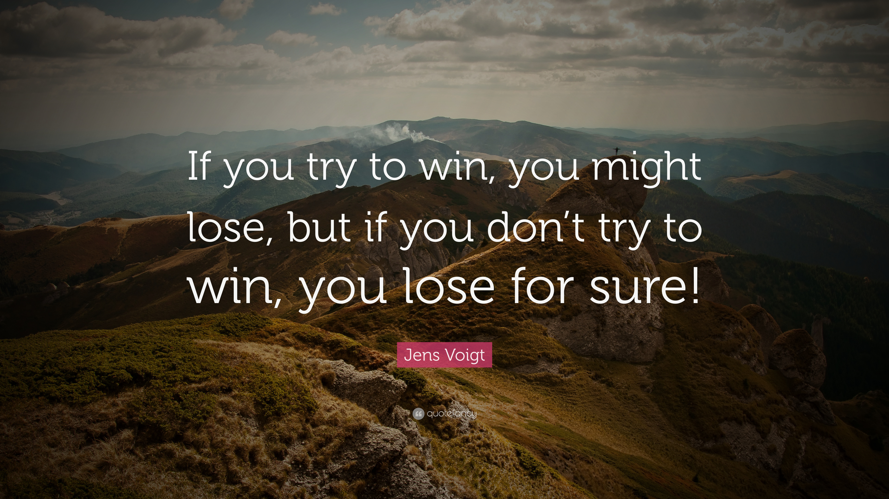

# reading-notes

### Growth mindset
the growth mindset believe you can't achieve a success just with talent and  intelligence but you can achieve a success with love to learn and and make effort
[brain growth](https://www.brainpickings.org/2014/01/29/carol-dweck-mindset/)
### keep yourself in growth mindset
- **don't afraid to challenge**
-  **take a brake (rest) , Ex:**
1. *stay with nature*

2. *travel to another county*

3. *go to sleep* 

- **nothing great come that easy** 
